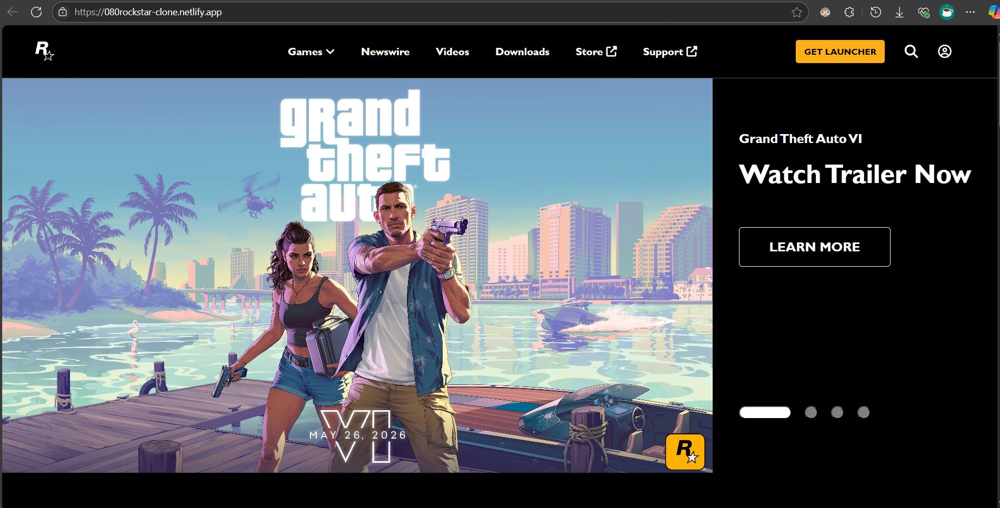
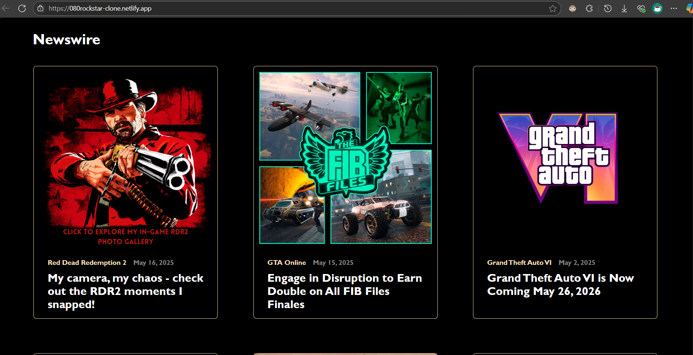
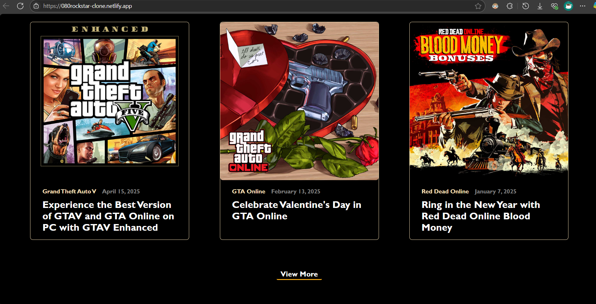
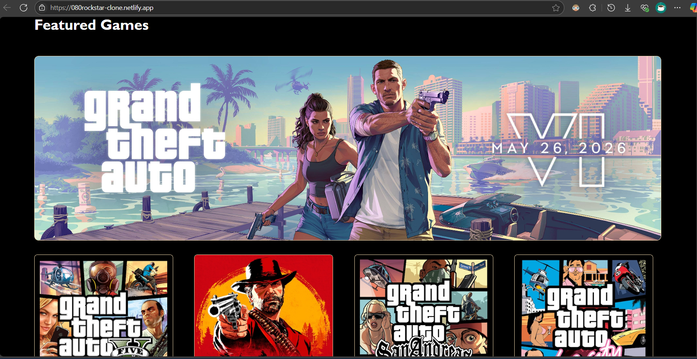
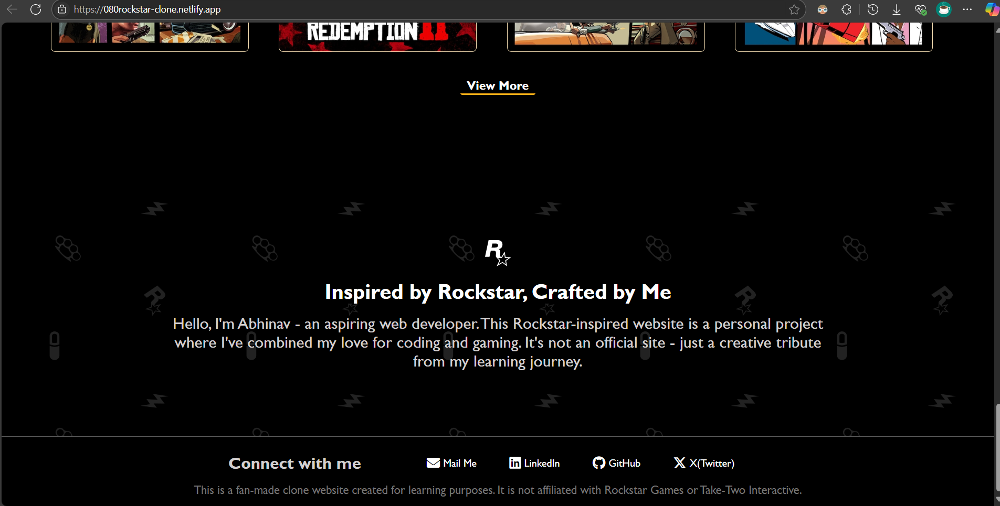

# <ins>Rockstar Website Clone</ins>

This is my **first website project** — a fan-made clone of the Rockstar Games homepage.  
It was created to practice and showcase my web development skills, including layout design, responsiveness, and styling using HTML and CSS.

---

> ## Live Demo  
> Deployed on Netlify: [Visit Live Site](https://080rockstar-clone.netlify.app/)  

---

## Technologies Used

- **HTML5**
- **CSS3**
- [**Font Awesome**](https://fontawesome.com/) — for icons

---

## Folder Structure
```
Rockstar clone/
│
├── index.html
├── rockstar.css
├── images/
│ └── (all image assets)
```

---

## Screenshots







---

## Disclaimer

This website is a **personal project** and is **not affiliated with Rockstar Games or Take-Two Interactive**.  
All trademarks, logos, and images belong to their respective owners.

---

## About Me
Hello, I'm **Abhinav Singh** - an aspiring web developer.  This project combines my love for `coding` and `gaming`.  
Feel free to connect with me:

Connect with me:

- [LinkedIn](https://www.linkedin.com/in/080abhinav/)
- [Email](mailto:08abhinav03singh@gmail.com)

---

Thanks for visiting! ⭐
